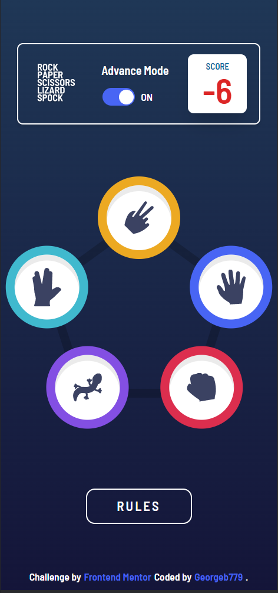
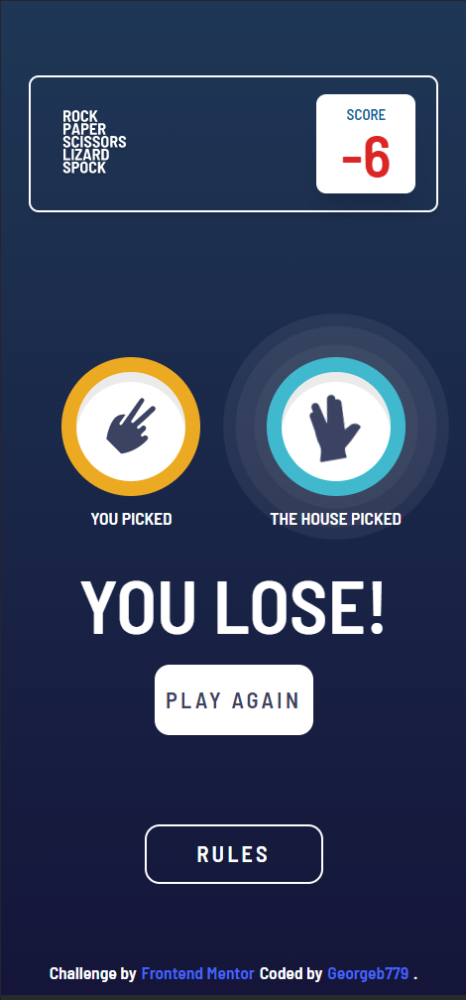
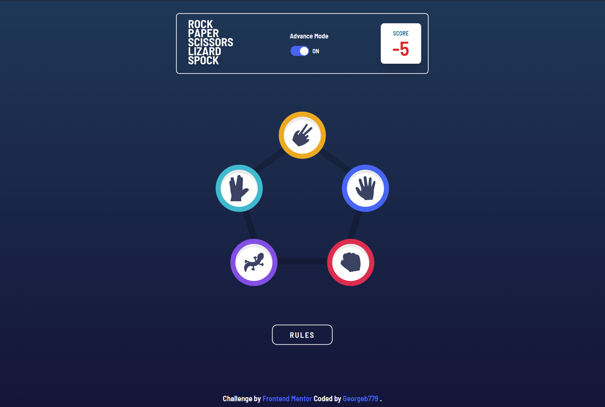
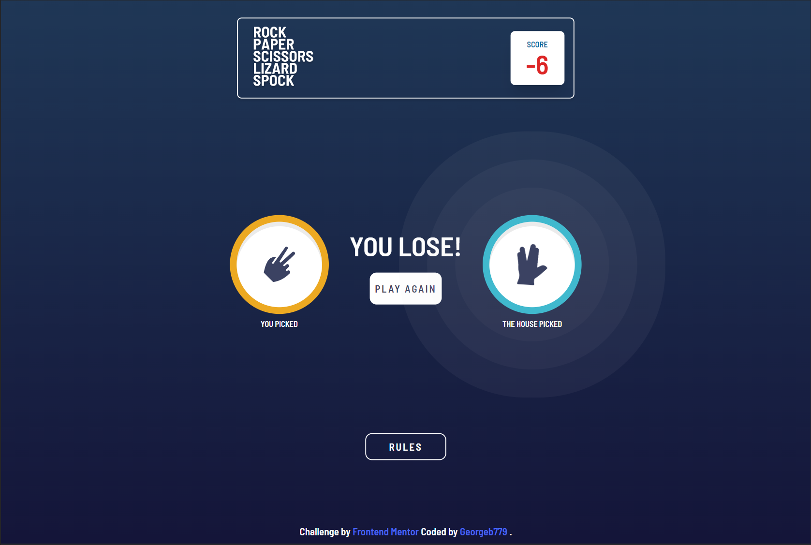

# Frontend Mentor - Rock, Paper, Scissors game

This is a solution to the [Rock, Paper, Scissors game challenge on Frontend Mentor](https://www.frontendmentor.io/challenges/rock-paper-scissors-game-pTgwgvgH).This challenge used a combination of technologies such a React, TypeScript, Tailwind CSS to recreate the typical Rock, Paper, Scissors, Lizard and Spock.

## 🧐 What's inside?

This Starter includes

- ⚡ [vite] (https://vitejs.dev/) - a fast and lightweight development server
- ⚛️ [React 18](https://reactjs.org/) - A JavaScript library for building user interfaces
- 📦 [Tailwind CSS](https://tailwindcss.com/) - A utility-first CSS framework for rapidly building custom designs
- ✨ [TypeScript](https://www.typescriptlang.org/) - TypeScript is a strongly typed programming language that builds on JavaScript, giving you better tooling at any scale.
- 🎉 [Sass](https://sass-lang.com/) - Sass is the most mature, stable, and powerful professional grade CSS extension language in the world.


## Overview

## 🚀 Getting Started

```
# Install dependencies

npm install
# or
yarn install

# Start development server

yarn dev
# or
npm run dev

# Build for production

yarn build
# or
npm run build
```

### The challenge

Users should be able to:

- View the optimal layout for the game depending on their device's screen size

- Play Rock, Paper, Scissors against the computer

- Maintain the state of the score after refreshing the browser (optional)

- Bonus: Play Rock, Paper, Scissors, Lizard, Spock against the computer (optional)

### Screenshot









### Links

- Solution URL: [Link to solution URL here](https://www.frontendmentor.io/solutions/rockpaperscissorsgame-aGq03ZDKPS)
- Live Site URL: [Link to live site](https://rock-paper-scissors-game-gb.netlify.app/)

## Author

- Frontend Mentor - [@Georgeb79](https://www.frontendmentor.io/profile/Georgeb779)
- Linkedin - [@GeorgeBaez](https://www.linkedin.com/in/george-baez/)
- Twitter - [@Georgeb779](https://twitter.com/Georgeb779)